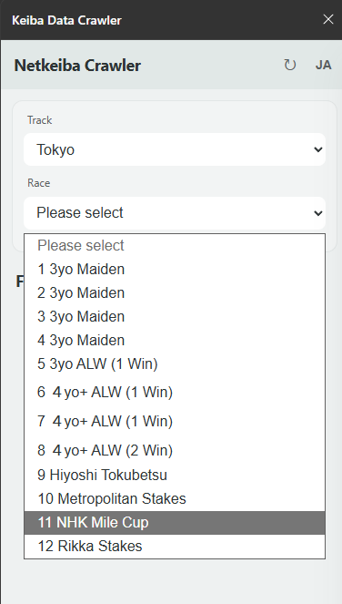
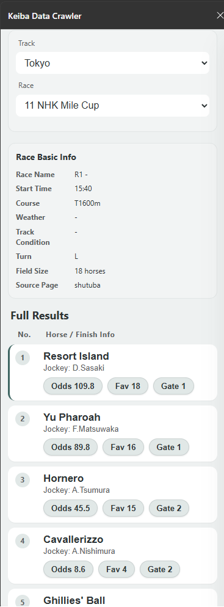
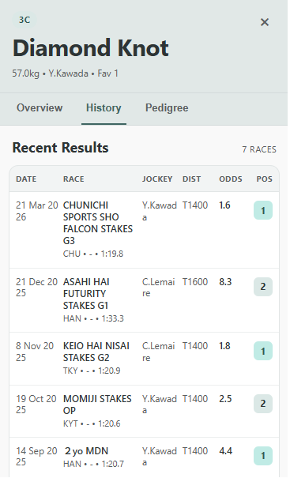
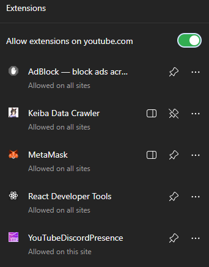

# Keiba Data Crawler 🐴

[**English**](#english-version) | [**日本語**](#japanese-version-日本語版)

---

## English Version

### 📖 About

Keiba Data Crawler is a Chrome extension that brings real-time horse racing data from Netkeiba directly to your browser. Designed for both casual horse racing enthusiasts and serious bettors, this tool provides instant access to race information, odds, horse details, and performance data without leaving your current webpage.

### ✨ Key Features

- **Race List Management**: Easily fetch and view available races from all racecourses
- **Racecourse & Race Selection**: Filter races by racecourse and race time
- **Live Odds Display**: View horse odds and betting information at a glance
- **Detailed Horse Information**: Access comprehensive horse statistics and pedigree data
- **Side Panel Interface**: Clean, intuitive UI that doesn't disrupt your browsing
- **Multi-Language Support**: Available in English and Japanese
- **Fast Data Fetching**: Optimized for quick data retrieval using modern parsing techniques

### 🚀 Quick Start (For All Users)

#### Prerequisites
- Google Chrome (latest version)
- Node.js 16+ and npm (for developers)

#### Installation Steps (For Everyone)

1. **Download & Extract**
   - Clone or download this repository to your computer

2. **Build the Extension** (Command Line Required)
   ```bash
   # Navigate to the project folder
   cd keiba-extension
   
   # Install dependencies
   npm install
   
   # Build the extension
   npm run build
   ```

3. **Load into Chrome**
   - Open Chrome and go to `chrome://extensions`
   - Enable **Developer Mode** (toggle in top-right corner)
   - Click **"Load unpacked"**
   - Select the `dist` folder from the project
   - The extension is now ready to use!

4. **Using the Extension**
   - Click the extension icon in your Chrome toolbar
   - Open the side panel
   - Click the refresh button (↻) in the header to load race data
   - Select a racecourse and race from the list
   - Click on any horse to view detailed information and odds

### 📸 Screenshots

#### 1) Race Selection Panel



*Shows the main interface where users select racecourse and race*

#### 2) Horse Odds Table



*Displays all horses in the race with their corresponding odds*

#### 3) Horse Details Panel



*Shows comprehensive horse statistics, performance data, and pedigree information*

#### 4) Extension Icon & Side Panel



*Shows how to access the extension from the Chrome toolbar*

### 🛠️ For Developers

#### Development Setup

```bash
# Watch mode - auto-recompiles on file changes (recommended during development)
npm run watch

# Or run dev server
npm run dev
```

#### Available Commands

| Command | Description |
|---------|-------------|
| `npm run dev` | Start Vite development server |
| `npm run build` | Build for production |
| `npm run watch` | Watch mode - rebuilds on file changes |
| `npm run lint` | Run ESLint code quality checks |
| `npm run preview` | Preview the built extension |

#### Project Structure

```
src/
├── api/           # Data fetching & parsing
├── background/    # Extension service worker
├── i18n/          # Internationalization (English, Japanese)
├── sidepanel/     # React UI components
└── utils/         # Helper functions & utilities
```

#### Technology Stack

- **Framework**: React 19 + Vite
- **Data Parsing**: Cheerio (for scraping Netkeiba data)
- **Internationalization**: i18next
- **Build Tool**: Vite + CRXJS
- **Linting**: ESLint

#### Reloading the Extension

After making changes to `manifest.json` or extension files:
1. Go to `chrome://extensions`
2. Click the **reload** button on the extension card

---

## Japanese Version (日本語版)

### 📖 概要

Keiba Data Crawler（競馬データクローラー）は、Netkeiba からのレース情報をリアルタイムで Chrome ブラウザに直接表示する Chrome 拡張機能です。競馬ファンから本格的な投票家まで、幅広いユーザーに対応し、現在のウェブページを離れることなく、レース情報、オッズ、馬詳細、成績データへのアクセスを提供します。

### ✨ 主な機能

- **レース一覧の管理**: 全競馬場から利用可能なレースを簡単に取得・表示
- **競馬場・レース選択**: 競馬場と開催時間でレースをフィルタリング
- **リアルタイムオッズ表示**: 馬のオッズと投票情報を一覧表示
- **馬の詳細情報**: 馬の統計データと血統情報へのアクセス
- **サイドパネル機能**: ブラウジングを邪魔しない洗練された UI
- **多言語対応**: 英語と日本語に対応
- **高速データ取得**: 最新の解析技術を使用した高速データ取得

### 🚀 クイックスタート（全ユーザー向け）

#### 必要な環境
- Google Chrome（最新版）
- Node.js 16 以上と npm（開発者向け）

#### インストール手順（誰でもできます）

1. **ダウンロード＆抽出**
   - このリポジトリをクローンまたはダウンロードしてコンピュータに保存

2. **拡張機能のビルド**（コマンドラインを使用）
   ```bash
   # プロジェクトフォルダに移動
   cd keiba-extension
   
   # 依存関係をインストール
   npm install
   
   # 拡張機能をビルド
   npm run build
   ```

3. **Chrome に読み込む**
   - Chrome を開いて `chrome://extensions` にアクセス
   - 右上の**デベロッパーモード**を有効化
   - **パッケージ化されていない拡張機能を読み込む**をクリック
   - プロジェクトの `dist` フォルダを選択
   - 拡張機能が使用可能になります！

4. **拡張機能の使用方法**
   - Chrome ツールバーの拡張機能アイコンをクリック
   - サイドパネルを開く
   - ヘッダーの更新ボタン（↻）をクリックしてレースデータを読み込む
   - リストから競馬場とレースを選択
   - 任意の馬をクリックして詳細情報とオッズを表示

### 📸 スクリーンショット

#### 1) レース選択パネル


*ユーザーが競馬場とレースを選択するメインインターフェース*

#### 2) 馬のオッズテーブル


*レースに出走する全馬とそれぞれのオッズを表示*

#### 3) 馬詳細パネル


*馬の統計情報、成績データ、血統情報を表示*

#### 4) 拡張機能アイコン＆サイドパネル


*Chrome ツールバーから拡張機能にアクセスする方法*

### 🛠️ 開発者向け

#### 開発環境のセットアップ

```bash
# ウォッチモード - ファイル変更時に自動的に再コンパイル（開発時推奨）
npm run watch

# または開発サーバーを実行
npm run dev
```

#### 利用可能なコマンド

| コマンド | 説明 |
|---------|------|
| `npm run dev` | Vite 開発サーバーを起動 |
| `npm run build` | 本番環境用にビルド |
| `npm run watch` | ウォッチモード - ファイル変更時に再ビルド |
| `npm run lint` | ESLint コード品質チェック実行 |
| `npm run preview` | ビルド結果をプレビュー |

#### プロジェクト構成

```
src/
├── api/           # データ取得とパース処理
├── background/    # 拡張機能のサービスワーカー
├── i18n/          # 多言語対応（英語、日本語）
├── sidepanel/     # React UI コンポーネント
└── utils/         # ヘルパー関数とユーティリティ
```

#### 技術スタック

- **フレームワーク**: React 19 + Vite
- **データパース**: Cheerio（Netkeiba スクレイピング用）
- **多言語対応**: i18next
- **ビルドツール**: Vite + CRXJS
- **コード品質**: ESLint

#### 拡張機能の再読み込み

`manifest.json` または拡張機能ファイルを変更した後：
1. `chrome://extensions` にアクセス
2. 拡張機能カードの**再読み込み**ボタンをクリック

